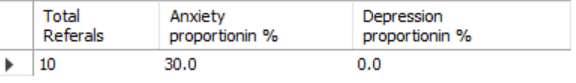
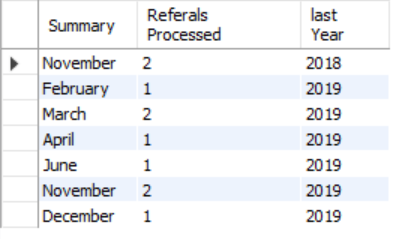
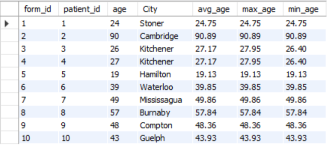
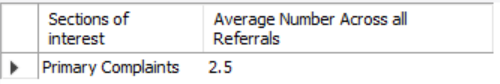

<H1>MySQL Database Sample</H1>

This repository contains the SQL files I wrote to generate a database for requests of referral to a hypothetical Cannabis clinic.

The project was made so that patient and doctor information, individual histories of complaints, and reasons of referral, as well the numbers of forms filed were all stored in 3rd normal form. The database was designed on creation to be easily updated with more information in the future.

The report SQL file was written to query in relevant results, some samples of you can preview below:

<H2>Disclaimer</H2>
All data was is fake. There has been no real personal information used in the creation and population of fields in this database.
